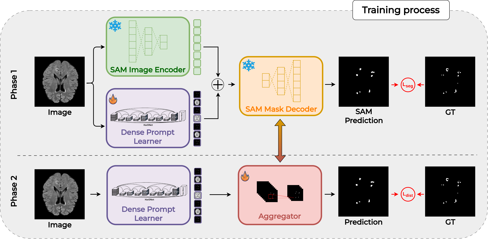

<div align="center">    
 
# SER: SAM-Guided Prompt Learning for Multiple Sclerosis Lesion Segmentation
F. Proietto Salanitri, G. Bellitto, S.Calcagno, U.Bagci, C. Spampinato, M.Pennisi

[](https://)


</div>

# 🔍 Overview

The official PyTorch implementation for __"SAM-Guided Prompt Learning for Multiple Sclerosis Lesion Segmentation"__. 

SER is a biologically-inspired saliency-driven modulation strategy for online continual learning, which regularizes classification features using visual saliency, effectively reducing forgetting.
The proposed approach, grounded on neurophysiological evidence, significantly improves performance of state-of-the-art OCL methods, and has been shown to be superior to other multibranch solutions, either biologically-inspired (e.g., DualNet) or based on attention mechanisms (e.g., TwF).

<div align="center">
 
</div>

### 📄 Paper abstract

Accurate segmentation of Multiple Sclerosis (MS) lesions remains a critical challenge in medical image analysis due to their small size, irregular shape, and sparse distribution. Despite recent progress in vision foundation models—such as SAM and its medical variant MedSAM—these models have not yet been explored in the context of MS lesion segmentation. Moreover, their reliance on manually crafted prompts and high inference-time computational cost limits their applicability in clinical workflows, especially in resource-constrained environments.
In this work, we introduce a novel training-time framework for effective and efficient MS lesion segmentation. Our method leverages SAM solely during training to guide a prompt learner that automatically discovers task-specific embeddings. At inference, SAM is replaced by a lightweight convolutional aggregator that maps the learned embeddings directly into segmentation masks—enabling fully automated, low-cost deployment.
We show that our approach significantly outperforms existing specialized methods on the public MSLesSeg dataset, establishing new performance benchmarks in a domain where foundation models had not previously been applied. To assess generalizability, we also evaluate our method on pancreas and prostate segmentation tasks, where it achieves competitive accuracy while requiring an order of magnitude fewer parameters and computational resources compared to SAM-based pipelines.
By eliminating the need for foundation models at inference time, our framework enables efficient segmentation without sacrificing accuracy.
This design bridges the gap between large-scale pretraining and real-world clinical deployment, offering a scalable and practical solution for MS lesion segmentation and beyond.

<div align="center">
  
</div>

#### Read the full paper on [PRLettersw](https://).


### 📂 Repository details

This repo relies on the [AutoSAM Framework](https://github.com/talshaharabany/AutoSAM) which has been modified to include the features described in the **MS-SAM-LESS** paper. 

# 💪 Training

The general command to launch a training is:

```shell
python 
```

# 📜 Citation

```bibtex

```
